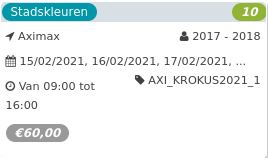

Stadskleuren *10*

Aximax 2017 - 2018  
15/02/2021, 16/02/2021, 17/02/2021, ... AXI\_KROKUS2021\_1  

Van 09:00 tot 16:00

*€60,00*

  

We gaan naar buiten en ontdekken hoeveel kleuren onze stad heeft. We verzamelen groene dingen om te knutselen, fotograferen rode dingen om een collage mee te maken en zoeken het kleurrijkste huis van de straat.

[Bekijk](https://tickets.vgc.be/activity/subscribe/AXI_KROKUS2021_1)

[Based on this search](https://tickets.vgc.be/activity/index?&vrijeplaatsen=1&Age%5B%5D=3%2C4&entity=152&Period%5B%5D=347)