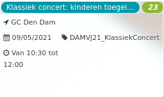

Klassiek concert: kinderen toegel... *23*

GC Den Dam 1920 - 2021  
09/05/2021 DAMVJ21\_KlassiekConcert  

Van 10:30 tot 12:00

  

  

Harpiste Anouk Sturtewagen, begeesterd door muziek sinds haar kinderjaren en veelvuldig winnaar van internationale wedstrijden, brengt o.a. muziek van J.S. Bach, CL. Debussy en nog vele anderen.  
Dit concert is er een waar ook kinderen welkom zijn ... omdat iedereen moet kunnen proeven van klass ...  
[Lees meer](https://tickets.vgc.be/activity/subscribe/DAMVJ21_KlassiekConcert)

[Aankopen](https://tickets.vgc.be/ticketingActivity/subscribe/DAMVJ21_KlassiekConcert)

[Based on this search](https://tickets.vgc.be/activity/index?&vrijeplaatsen=1&Age%5B%5D=3%2C4&entity=278&Period%5B%5D=347)