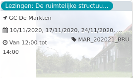

Lezingen: De ruimtelijke structuu...

GC De Markten  
10/11/2020, 17/11/2020, 24/11/2020, ... MAR\_202021\_BRU  

Van 12:00 tot 14:00

  

  

Arm en rijk, oud en jong, Belgen en migranten wonen niet door elkaar in de stad. En ze wonen ook niet in gelijkaardige woningen en buurten. Hoe komt deze stedelijke residentiële differentiatie tot stand? Wanneer is er sprake van segregatie en getto’s? Welke processen zorgen voor verandering in de ...  
[Lees meer](https://tickets.vgc.be/activity/subscribe/MAR_202021_BRU)

[Aankopen](https://tickets.vgc.be/ticketingActivity/subscribe/MAR_202021_BRU)

[Based on this search](https://tickets.vgc.be/activity/index?&vrijeplaatsen=1&Age%5B%5D=3%2C4&entity=244)