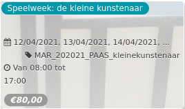

Speelweek: de kleine kunstenaar

  
12/04/2021, 13/04/2021, 14/04/2021, ... MAR\_202021\_PAAS\_kleinekunstenaar  

Van 08:00 tot 17:00

*€80,00*

  

Wil jij leren schilderen als Picasso? Dromen als Panamarenko? Kom tijdens de paasvakantie naar De Markten en dompel je onder in de wondere wereld van kunstenaars.  
  
FR -- Apprenez à peindre comme Picasso et à rêver comme Panamarenko pendant cette semaine.  
ENG -- Learn to paint lik ...  
[Lees meer](https://tickets.vgc.be/activity/subscribe/MAR_202021_PAAS_kleinekunstenaar)

[Bekijk](https://tickets.vgc.be/activity/subscribe/MAR_202021_PAAS_kleinekunstenaar)

[Based on this search](https://tickets.vgc.be/activity/index?&vrijeplaatsen=1&Age%5B%5D=3%2C4&entity=244)