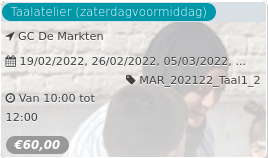

Taalatelier voormiddag

GC De Markten  
19/02/2022, 26/02/2022, 05/03/2022, ... MAR\_202122\_Taal1\_2  

Van 10:00 tot 12:00

*€60,00*

  

Ga je naar een Nederlandstalige school, maar spreek je thuis een andere taal? Dan is dit taalatelier iets voor jou! Oefen in dit atelier je Nederlands tijdens het spelen, zingen, knutselen, verhalen lezen en zo veel meer.  
  
FR - Dans cet atelier, les enfants apprennent lenéerlandais de m  ...  
[Lees meer](https://tickets.vgc.be/activity/subscribe/MAR_202122_Taal1_2)

[Bekijk](https://tickets.vgc.be/activity/subscribe/MAR_202122_Taal1_2)

[Based on this search](https://tickets.vgc.be/activity/index?&vrijeplaatsen=1&Age%5B%5D=3%2C5&entity=244)