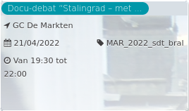

Docu-debat “Stalingrad – met ...

GC De Markten  
21/04/2022 MAR\_2022\_sdt\_bral  

Van 19:30 tot 22:00

  

  

De documentaire 'Stalingrad, met of zonder ons?' vereeuwigde de transformaties van deze Brusselse levensader die het Zuidstation verbindt met het Rouppeplein. Vijf bewoners van de Stalingradwijk en het Centre Vidéo de Bruxelles filmden de titanenwerf en de schrik die het veroorzaakt bij bewoners en ...  
[Lees meer](https://tickets.vgc.be/activity/subscribe/MAR_2022_sdt_bral)

[Aankopen](https://tickets.vgc.be/ticketingActivity/subscribe/MAR_2022_sdt_bral)

[Based on this search](https://tickets.vgc.be/activity/index?&vrijeplaatsen=1&Age%5B%5D=3%2C5&entity=244)