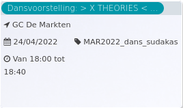

De dag van de Dans: > X THEORIES ...

GC De Markten  
24/04/2022 MAR2022\_dagvddans\_sudakas  

Van 18:00 tot 18:40

  

  

Is het mogelijk om te theoretiseren over liefde? Onze theorieën werden lichamen. Aanraking en contact, eenzaamheid, vlees, samen en apart.  
  
Door: Les Sudakas Collective  
Regie: Lola Vera  
Performers: Paz Moreno, Florencia Papaleo Yaccuzzi, Felix Rapela, Juan Rossi, Gonzalo Roja ...  
[Lees meer](https://tickets.vgc.be/activity/subscribe/MAR2022_dagvddans_sudakas)

[Aankopen](https://tickets.vgc.be/ticketingActivity/subscribe/MAR2022_dagvddans_sudakas)

[Based on this search](https://tickets.vgc.be/activity/index?&vrijeplaatsen=1&Age%5B%5D=3%2C5&entity=244)