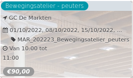

Bewegingsatelier - peuters

GC De Markten  
01/10/2022, 08/10/2022, 15/10/2022, ... MAR\_202223\_Bewegingsatelier\_peuters  

Van 10:00 tot 11:00

*€90,00*

  

  

Peuters ontdekken de wereld en zichzelf in dit wekelijks bewegingsatelier. Aan de hand van speelse bewegingen, spelletjes, muziek, dans en nog veel meer wordt gewerkt aan het lichaamsbewustzijn van het kind en zijn gevoel voor ruimte. De aandacht gaat vooral uit naar de fantasie, maar hier en daar k ...  
[Lees meer](https://tickets.vgc.be/activity/subscribe/MAR_202223_Bewegingsatelier_peuters)

[Inschrijven](https://tickets.vgc.be/activity/subscribe/MAR_202223_Bewegingsatelier_peuters)

[Based on this search](https://tickets.vgc.be/activity/index?&vrijeplaatsen=1&Age%5B%5D=4%2C6&entity=244)