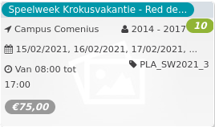

Speelweek Krokusvakantie - Red de... *10*

Campus Comenius 2014 - 2017  
15/02/2021, 16/02/2021, 17/02/2021, ... PLA\_SW2021\_3  

Van 08:30 tot 17:00

*€75,00*

  

Tijdens deze speelweek leren kinderen anders kijken en denken over de wereld. Centraal staat het thema ‘duurzaamheid’ in al z’n facetten. Wat houdt zero-waste juist in? Hoe maak je muziekinstrumenten uit gerecycleerd materiaal? Kan je knutselen met afval? Een unieke workshop zowel binnen als b  ...  
[Lees meer](https://tickets.vgc.be/activity/subscribe/PLA_SW2021_3)

[Bekijk](https://tickets.vgc.be/activity/subscribe/PLA_SW2021_3)

[Based on this search](https://tickets.vgc.be/activity/index?&vrijeplaatsen=1&Age%5B%5D=3%2C4&entity=286)