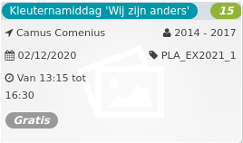

Kleuternamiddag 'Wij zijn anders' *15*

Camus Comenius 2014 - 2017  
02/12/2020 PLA\_EX2021\_1  

Van 13:15 tot 16:30

*Gratis*

  

  

3 December is internationale dag van personen met een beperking. Maar wat betekent dat nu, anders zijn?  
Met de kleuters gaan we dit ontdekken. De Bibliotheek van Koekelberg houdt een voorleesmoment waarbij het thema 'anders zijn' centraal staat. We gaan vervolgens spelen met een beperking om te  ...  
[Lees meer](https://tickets.vgc.be/activity/subscribe/PLA_EX2021_1)

[Inschrijven](https://tickets.vgc.be/activity/subscribe/PLA_EX2021_1)

[Based on this search](https://tickets.vgc.be/activity/index?&vrijeplaatsen=1&Age%5B%5D=3%2C4&entity=286)