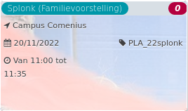

Splonk (Familievoorstelling) *67*

Campus Comenius 1900 - 2020  
20/11/2022 PLA\_22splonk  

Van 11:00 tot 11:35

  

  

Wie zich verstopt is te zien. Wie fluistert roept het hardst. Wie beweegt is een standbeeld. Wie tekent hoort een lied. Ontdek een nieuwe taal en bedenk de breedste sprong. Kom mee op reis en ontmoet Streep, Spiraal, Toeter en Blauw.  
SPLONK! is een geïmproviseerde theatervoorstelling voor  ...  
[Lees meer](https://tickets.vgc.be/activity/subscribe/PLA_22splonk)

[Aankopen](https://tickets.vgc.be/ticketingActivity/subscribe/PLA_22splonk)

[Based on this search](https://tickets.vgc.be/activity/index?&vrijeplaatsen=1&Age%5B%5D=4%2C6&entity=286)