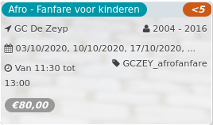

Afro - Fanfare voor kinderen *<5*

GC De Zeyp 2004 - 2016  
03/10/2020, 04/10/2020, 05/10/2020, ... GCZEY\_afrofanfare  

Van 11:30 tot 13:00

*€80,00*

  

###### *Haast u! Er zijn nog maar enkele plaatsen over.*

  

Daniel Dzidzonu wilt zijn kennis over de West-Afrikaanse blaasinstrumenten en percussie delen met kinderen en jongeren van 6 tot 16 jaar.  
De fanfare komt 1x per week, 1,5 uur samen, er wordt samen muziek gespeeld in een ontspannen sfeer. Er is geen muzikale voorkennis vereist!

[Inschrijven](https://tickets.vgc.be/activity/subscribe/GCZEY_afrofanfare)

[Based on this search](https://tickets.vgc.be/activity/index?&vrijeplaatsen=1&Age%5B%5D=3%2C4&entity=276)