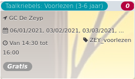

Taalkriebels: Voorlezen (3-6 jaar) *<5*

  
06/01/2021, 03/02/2021, 03/03/2021, ... ZEY\_voorlezen  

Van 14:30 tot 16:00

*Gratis*

  

###### *Haast u! Er zijn nog maar enkele plaatsen over.*

  

Elke week organiseren we een activiteit voor kinderen die het Nederlands wel beheersen maar wat extra oefening kunnen gebruiken. Een speelse manier om in contact te komen met Nederlands buiten de schooluren. Elke eerste woensdag van de maand: voorleesuurtje/samen lezen in de bibliotheek voor kindere  ...  
[Lees meer](https://tickets.vgc.be/activity/subscribe/ZEY_voorlezen)

[Inschrijven](https://tickets.vgc.be/activity/subscribe/ZEY_voorlezen)

[Based on this search](https://tickets.vgc.be/activity/index?&vrijeplaatsen=1&Age%5B%5D=3%2C4&entity=276)