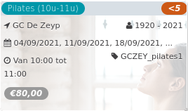

Pilates (10u-11u) *<5*

GC De Zeyp 1920 - 2021  
04/09/2021, 11/09/2021, 18/09/2021, ... GCZEY\_pilates1  

Van 10:00 tot 11:00

*€80,00*

  

###### *Haast u! Er zijn nog maar enkele plaatsen over.*

  

Pilates is een effectieve en veilige methode om je buik-, bil-, rug en bekkenbodemspieren te trainen. Houding, stabiliteit, coördinatie, ademhaling en focus op lichaam en geest zijn de uitgangspunten. Op hetzelfde ogenblik gaat er multimove voor kleuters door. Zo kunnen ouders een uur sporten zonde  ...  
[Lees meer](https://tickets.vgc.be/activity/subscribe/GCZEY_pilates1)

[Inschrijven](https://tickets.vgc.be/activity/subscribe/GCZEY_pilates1)

[Based on this search](https://tickets.vgc.be/activity/index?&vrijeplaatsen=1&Age%5B%5D=3%2C4&entity=276)