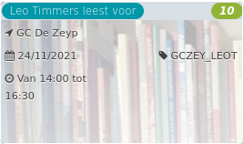

Leo Timmers leest voor *6*

GC De Zeyp 1830 - 2025  
24/11/2021 GCZEY\_LEOT  

Van 14:00 tot 16:30

  

  

Leo Timmers brengt een interactieve lezing over zijn nieuwste boek voor de jeugd van 4 tot 6 jaar.  
Hij begon op zijn twaalfde al strips te tekenen. Na zijn studies publiciteit en grafische vormgeving illustreerde hij voor verschillende bladen (Knack, Humo, De Standaard), maakte omslagen voor j  ...  
[Lees meer](https://tickets.vgc.be/activity/subscribe/GCZEY_LEOT)

[Aankopen](https://tickets.vgc.be/ticketingActivity/subscribe/GCZEY_LEOT)

[Based on this search](https://tickets.vgc.be/activity/index?&vrijeplaatsen=1&Age%5B%5D=3%2C5&entity=276)