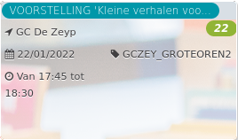

VOORSTELLING 'Kleine verhalen voo... *22*

GC De Zeyp 2014 - 2017  
22/01/2022 GCZEY\_GROTEOREN2  

Van 17:45 tot 18:30

  

  

Bosverhalen. Wolfverhalen. Verhalen om te lachen. Verhalen om te boeien. Verhalen voor kleine en grote oortjes voor jonge alsook oudere oogjes. Zoetheid en fantasie, in de bibliotheek, comfortabel geïnstalleerd, waar we luisteren, waar we kijken. Een reis naar het land der verhalen, waar er beelden ...  
[Lees meer](https://tickets.vgc.be/activity/subscribe/GCZEY_GROTEOREN2)

[Aankopen](https://tickets.vgc.be/ticketingActivity/subscribe/GCZEY_GROTEOREN2)

[Based on this search](https://tickets.vgc.be/activity/index?&vrijeplaatsen=1&Age%5B%5D=3%2C5&entity=276)