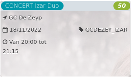

CONCERT Izar Duo *38*

GC De Zeyp  
18/11/2022 GCDEZEY\_IZAR  

Van 20:00 tot 21:15

  

  

**‘Izar’ is een heldere dubbelster in ons sterrenstelsel: twee sterren, die samen een mooi geheel vormen.**  
Het repertoire van Izar Duo - Margot Welleman (begeleidster aan de Academie van Jette) en Lokke Van der Ven - focust zich op dat voor piano vierhandig en ...  
[Lees meer](https://tickets.vgc.be/activity/subscribe/GCDEZEY_IZAR)

[Aankopen](https://tickets.vgc.be/ticketingActivity/subscribe/GCDEZEY_IZAR)

[Based on this search](https://tickets.vgc.be/activity/index?&vrijeplaatsen=1&Age%5B%5D=4%2C6&entity=276)