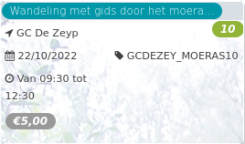

Wandeling met gids door het moera... *12*

GC De Zeyp  
22/10/2022 GCDEZEY\_MOERAS10  

Van 09:30 tot 12:30

  

  

**Afspraak en eindpunt wandeling: op de begraafplaats van Ganshoren  
ism Brukselbinnenstebuiten  
**  
Het moeras van Ganshoren vormt samen met het stroomafwaarts gelegen moeras van Jette één van de laatste restanten van de vochtige gebieden in de Molenbeekvallei. Het ligt g ...  
[Lees meer](https://tickets.vgc.be/activity/subscribe/GCDEZEY_MOERAS10)

[Aankopen](https://tickets.vgc.be/ticketingActivity/subscribe/GCDEZEY_MOERAS10)

[Based on this search](https://tickets.vgc.be/activity/index?&vrijeplaatsen=1&Age%5B%5D=4%2C6&entity=276)