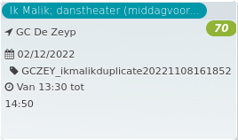

Ik Malik; danstheater (middagvoor... *70*

GC De Zeyp  
02/12/2022 GCZEY\_ikmalikduplicate20221108161852  

Van 13:30 tot 14:50

  

  

Malik kwam op zijn acht met zijn moeder en zus van Kenya naar België.  
Hij moest zijn land, thuis, taal, school en vrienden achterlaten, en hier van nul opnieuw beginnen. 'ik malik' is zijn verhaal: in tekst, spoken word en dans, in het Nederlands en Engels. Hoe hij profvoetballer wilde worden. ...  
[Lees meer](https://tickets.vgc.be/activity/subscribe/GCZEY_ikmalikduplicate20221108161852)

[Aankopen](https://tickets.vgc.be/ticketingActivity/subscribe/GCZEY_ikmalikduplicate20221108161852)

[Based on this search](https://tickets.vgc.be/activity/index?&vrijeplaatsen=1&Age%5B%5D=4%2C6&entity=276)