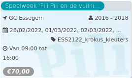

Speelweek 'Pili Pili en de vuilni...

GC Essegem 2016 - 2018  
28/02/2022, 01/03/2022, 02/03/2022, ... ESS2122\_krokus\_kleuters  

Van 09:00 tot 16:00

*€70,00*

  

Pili Pili woont op een vuilnisbelt en verzamelt groenafval. Daarvan maakt ze heerlijke soepjes voor de andere beestjes die op de vuilnisbelt leven. Ook zij verzamelen en recycleren afval. Een hele week speelt, beweegt en knutselt jouw kleuter rond het boek ‘Pili Pili en de vuilnisbeltbeestjes’ v ...  
[Lees meer](https://tickets.vgc.be/activity/subscribe/ESS2122_krokus_kleuters)

[Bekijk](https://tickets.vgc.be/activity/subscribe/ESS2122_krokus_kleuters)

[Based on this search](https://tickets.vgc.be/activity/index?&vrijeplaatsen=1&Age%5B%5D=3%2C5&entity=109)