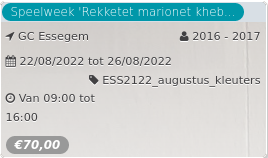

Speelweek 'Rekketet marionet kheb...

GC Essegem 2016 - 2017  
22/08/2022 tot 26/08/2022 ESS2122\_augustus\_kleuters  

Van 09:00 tot 16:00

*€70,00*

  

Wie is Pinokkio? Is hij braaf of is hij eigenlijk heel stout? Wat is kattenkwaad? En bestaat er dan ook hondenboos? Tijdens deze speelweek, speciaal in elkaar gebokst en begeleid door Sarah Bourgeois van De verhalenbakkerij, vinden we uit, maken we, spelen we, voelen we, tateren we en maken w

...  
[Lees meer](https://tickets.vgc.be/activity/subscribe/ESS2122_augustus_kleuters)

[Bekijk](https://tickets.vgc.be/activity/subscribe/ESS2122_augustus_kleuters)

[Based on this search](https://tickets.vgc.be/activity/index?&vrijeplaatsen=1&Age%5B%5D=3%2C5&entity=109)