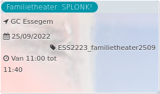

Familietheater: SPLONK!

GC Essegem < 2020  
25/09/2022 ESS2223\_familietheater2509  

Van 11:00 tot 11:40

  

Wie zich verstopt is te zien. Wie fluistert roept het hardst. Wie beweegt is een standbeeld. Wie tekent hoort een lied. Ontdek een nieuwe taal en bedenk de breedste sprong. Kom mee op reis en ontmoet Streep, Spiraal, Toeter en Blauw.  
  
Improvisator Sara van der Zande en muzikant Rik Staelen ...  
[Lees meer](https://tickets.vgc.be/activity/subscribe/ESS2223_familietheater2509)

[Bekijk](https://tickets.vgc.be/ticketingActivity/subscribe/ESS2223_familietheater2509)

[Based on this search](https://tickets.vgc.be/activity/index?&vrijeplaatsen=1&Age%5B%5D=4%2C6&entity=109)