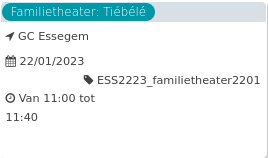

Familietheater: Tiébélé

GC Essegem < 2021  
22/01/2023 ESS2223\_familietheater2201  

Van 11:00 tot 11:40

  

  

Als een jonge vrouw klei en water mengt en daarmee begint te tekenen, ontvouwt zich een ontroerend schouwspel. Ze kleit, kliedert, krabbelt en verkent zo de geschiedenis van haar voorouders. Heden en verleden mengen zich in een tekening van klei.  
  
Op de tonen van het snarenspel van de N'gon ...  
[Lees meer](https://tickets.vgc.be/activity/subscribe/ESS2223_familietheater2201)

[Aankopen](https://tickets.vgc.be/ticketingActivity/subscribe/ESS2223_familietheater2201)

[Based on this search](https://tickets.vgc.be/activity/index?&vrijeplaatsen=1&Age%5B%5D=3%2C5&entity=109)