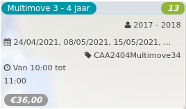

Multimove 3 - 4 jaar *13*

2017 - 2018  
24/04/2021, 08/05/2021, 15/05/2021, ... CAA2404Multimove34  

Van 10:00 tot 11:00

*€36,00*

  

  

Tijdens de multimove lessen worden ze allerlei sportieve basisbewegingen aangeleerd. Dribbelen, glijden, heffen en dragen, klimmen, roteren, slaan, springen en landen, trappen, trekken en duwen, vangen en werpen, wandelen en lopen, zwaaien. Multimove prikkelt en bevordert met het nodige spelplezier ...  
[Lees meer](https://tickets.vgc.be/activity/subscribe/CAA2404Multimove34)

[Inschrijven](https://tickets.vgc.be/activity/subscribe/CAA2404Multimove34)

[Based on this search](https://tickets.vgc.be/activity/index?&vrijeplaatsen=1&Age%5B%5D=3%2C4&entity=242&Period%5B%5D=347)