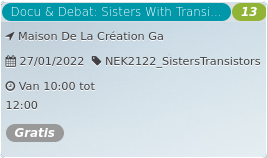

Docu & Debat: Sisters With Transi... *13*

Maison De La Création Ga  
27/01/2022 NEK2122\_SistersTransistors  

Van 10:00 tot 12:00

*Gratis*

  

  

Het opmerkelijke, amper gekende verhaal van de vrouwelijke pioniers van de elektronische muziek. Een heerlijke audiovisuele proeverij die een blik werpt op de fascinerende geschiedenis van een bijzonder muziekgenre én van de onderliggende emancipatiestrijd van vrouwen in de geschiedenis van de muzi ...  
[Lees meer](https://tickets.vgc.be/activity/subscribe/NEK2122_SistersTransistors)

[Inschrijven](https://tickets.vgc.be/activity/subscribe/NEK2122_SistersTransistors)

[Based on this search](https://tickets.vgc.be/activity/index?&vrijeplaatsen=1&Age%5B%5D=3%2C5&entity=241)