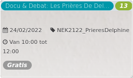

Docu & Debat: Les Prières De Del... *13*

  
24/02/2022 NEK2122\_PrieresDelphine  

Van 10:00 tot 12:00

*Gratis*

  

  

De regisseuse interviewt haar vriendin en landgenote Delphine, een Kameroense die vanaf haar veertiende seksueel is uitgebuit. Om aan haar lot te ontsnappen heeft ze een Belg gehuwd die bijna driemaal zo oud is als zij. Door de informele aanpak van de regisseuse worden de zware onderwerpen met een d  ...  
[Lees meer](https://tickets.vgc.be/activity/subscribe/NEK2122_PrieresDelphine)

[Inschrijven](https://tickets.vgc.be/activity/subscribe/NEK2122_PrieresDelphine)

[Based on this search](https://tickets.vgc.be/activity/index?&vrijeplaatsen=1&Age%5B%5D=3%2C5&entity=241)