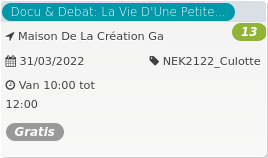

Docu & Debat: La Vie D'Une Petite... *13*

Maison De La Création Ga  
31/03/2022 NEK2122\_Culotte  

Van 10:00 tot 12:00

*Gratis*

  

Deze documentaire dompelt je onder in het alledaagse bestaan van zij die in de schaduw van de textielindustrie leven. Het verhaal van dit onderbroekje brengt ons van land naar land binnen in het intieme leven van deze vijf vrouwen, elk van hen een schakel in de globale productieketen. Welke waarde h ...  
[Lees meer](https://tickets.vgc.be/activity/subscribe/NEK2122_Culotte)

[Bekijk](https://tickets.vgc.be/activity/subscribe/NEK2122_Culotte)

[Based on this search](https://tickets.vgc.be/activity/index?&vrijeplaatsen=1&Age%5B%5D=3%2C4&entity=241)