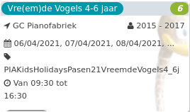

Vre(em)de Vogels 4-6 jaar *6*

GC Pianofabriek 2015 - 2017  
06/04/2021, 07/04/2021, 08/04/2021, ... PIAKidsHolidaysPasen21VreemdeVogels4\_6j  

Van 09:30 tot 16:30

*€70,00*

  

Samen met de kunstenaars van MUS-E gaan we met de kinderen creatief aan de slag rond concepten zoals gelijkheid, vrijheid en vrede.  

[Bekijk](https://tickets.vgc.be/activity/subscribe/PIAKidsHolidaysPasen21VreemdeVogels4_6j)

[Based on this search](https://tickets.vgc.be/activity/index?&vrijeplaatsen=1&Age%5B%5D=3%2C4&entity=246&Period%5B%5D=347)