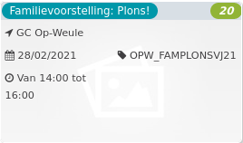

Familievoorstelling: Plons! *20*

GC Op-Weule 1920 - 2017  
28/02/2021 OPW\_FAMPLONSVJ21  

Van 14:00 tot 16:00

  

  

Plons (4+) is een beeldend verhaal over een kleine kikker en de wondere wereld boven en onder water.  
In Plons volgen we kikker Kiki, die geboren wordt als klein kikkervisje. Langzaam ontdekt Kiki de wereld om haar heen en raakt verwonderd door de schoonheid van de vijver. Kiki verandert, wordt g  ...  
[Lees meer](https://tickets.vgc.be/activity/subscribe/OPW_FAMPLONSVJ21)

[Aankopen](https://tickets.vgc.be/ticketingActivity/subscribe/OPW_FAMPLONSVJ21)

[Based on this search](https://tickets.vgc.be/activity/index?&vrijeplaatsen=1&Age%5B%5D=3%2C4&entity=282&Period%5B%5D=347)