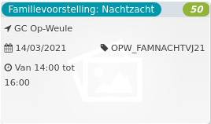

Familievoorstelling: Nachtzacht *50*

GC Op-Weule 1920 - 2018  
14/03/2021 OPW\_FAMNACHTVJ21  

Van 14:00 tot 16:00

  

  

NACHTZACHT  
Ubi slaapt, hij droomt.  
Maar… is het enkel een droom? Of gebeurt het… écht? Die wondere wereld, met dieren overal, met land en stad en berg en zee… Droom jij met ons mee?  
‘Nachtzacht’ is een intieme, poëtische muziekvertelling Voor dromers vanaf 3 jaar.  
...  
[Lees meer](https://tickets.vgc.be/activity/subscribe/OPW_FAMNACHTVJ21)

[Aankopen](https://tickets.vgc.be/ticketingActivity/subscribe/OPW_FAMNACHTVJ21)

[Based on this search](https://tickets.vgc.be/activity/index?&vrijeplaatsen=1&Age%5B%5D=3%2C4&entity=282&Period%5B%5D=347)